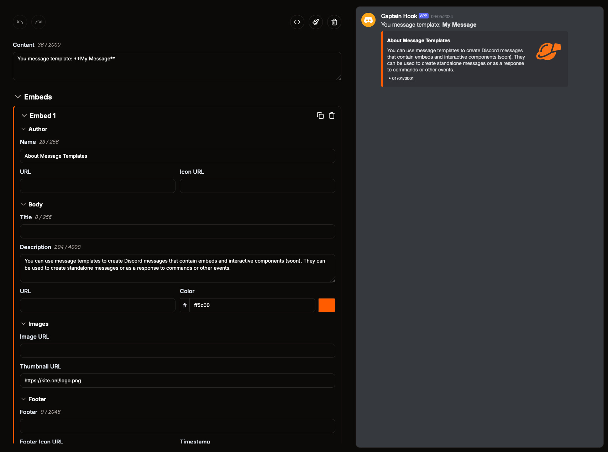

# Bắt đầu

Hãy bắt đầu thôi! Bước đầu tiên là tạo một ứng dụng Discord mới.

:::tip

Discord thường dùng hai thuật ngữ `bot` và `app` thay thế cho nhau trong tài liệu và hầu hết ngữ cảnh khác. Về mặt kỹ thuật, `app` là thuật ngữ chính xác hơn, nhưng trong tài liệu này chúng tôi vẫn dùng `bot` ở một số chỗ để dễ hiểu.

:::

## Tạo ứng dụng

Mở [Discord Developer Portal](https://discord.com/developers/applications) và đăng nhập bằng tài khoản Discord của bạn. Đây là nơi bạn tạo và quản lý ứng dụng Discord.

1. Bấm `New Application` ở góc phải trên cùng và đặt tên cho ứng dụng
2. Tải lên biểu tượng cho ứng dụng
3. Đảm bảo trường `Interaction Endpoint Url` để trống
4. Chuyển sang mục `Bot` ở thanh bên trái
5. Bật `Presence Intent`, `Server Members Intent` và `Message Content Intent`
6. Bấm `Reset Token` và sao chép token của bot

Thay vì tạo ứng dụng mới, bạn cũng có thể thêm ứng dụng Discord đã có vào Vibe Bot. Chỉ cần đảm bảo cấu hình đúng như hướng dẫn ở trên.

## Thêm ứng dụng vào Vibe Bot

Sau khi tạo ứng dụng trong Discord, bước tiếp theo là thêm ứng dụng đó vào Vibe Bot.

Mở [bảng điều khiển Vibe Bot](https://kite.onl/apps) và đăng nhập bằng tài khoản Discord của bạn. Tại đây bạn có thể thêm ứng dụng, quản lý lệnh và nhiều thứ khác.

1. Bấm `Create app` ở phía dưới
2. Điền bot token và bấm `Create app`
3. Bấm `Open app` cạnh tên ứng dụng

Vậy là bạn đã thêm ứng dụng vào Vibe Bot và sẵn sàng tạo lệnh đầu tiên.

## Mời ứng dụng

Bây giờ bạn có thể mời ứng dụng vào server Discord của mình. Thông thường, bạn nên kiểm thử trên một server nhỏ trước khi đưa vào server thật có nhiều người dùng.

Chỉ cần bấm `Invite app` ở góc trên bên phải trang tổng quan và chọn server bạn muốn thêm ứng dụng vào.

## Tạo lệnh đầu tiên

1. Bấm biểu tượng `/` trên thanh bên trái của bảng điều khiển
2. Bấm `Create command` và đặt tên, mô tả cho lệnh
3. Trong trình soạn thảo no-code, kéo khối `Tạo tin nhắn phản hồi` từ danh sách khối bên trái
4. Nối khối này với khối lệnh bằng cách kéo chuột từ chấm xanh của khối này sang khối kia
5. Bấm vào khối `Tạo tin nhắn phản hồi` và nhập nội dung phản hồi
6. Lưu lệnh bằng cách bấm `Save Changes` ở phía trên

Đã đến lúc thử ngay trong Discord!

Lệnh mới có thể mất đến một phút để hiển thị trong Discord. Hãy đảm bảo bạn đã mời ứng dụng vào server và thử khởi động lại Discord nếu lệnh chưa xuất hiện.

## Tạo mẫu tin nhắn đầu tiên

1. Bấm biểu tượng phong bì ở thanh bên trái bảng điều khiển
2. Bấm `Create message` và đặt tên, mô tả cho tin nhắn
3. Trong trình soạn thảo tin nhắn, nhập nội dung, chỉnh embed và thiết kế theo ý muốn
4. Lưu tin nhắn bằng cách bấm `Save Changes` ở phía trên
5. Bấm `Send Message` để gửi tin nhắn tới kênh mà ứng dụng có quyền truy cập

Bạn cũng có thể dùng mẫu tin nhắn vừa tạo làm phản hồi cho lệnh đã tạo trước đó.
