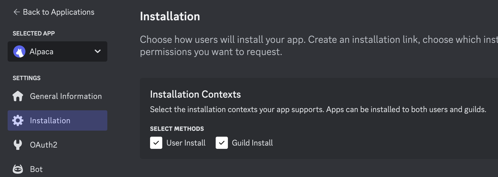
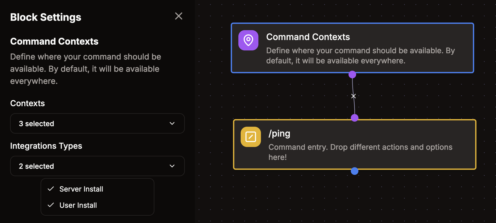

# Ứng dụng cài đặt cho người dùng

Ứng dụng Discord thường được cài bởi quản trị viên server và chỉ hoạt động trong server đó. Tuy nhiên, Discord cũng hỗ trợ ứng dụng cài đặt theo người dùng, có thể hoạt động trên mọi server mà người dùng có quyền truy cập. Dù có một số giới hạn so với ứng dụng cài theo server, loại ứng dụng này rất phù hợp cho các công cụ cá nhân dùng ở mọi nơi.

Vibe Bot giúp bạn dễ dàng tạo ứng dụng Discord cài đặt theo người dùng mà không cần viết code. Hướng dẫn này sẽ đi qua toàn bộ quá trình tạo và cấu hình.

:::note
Một số server Discord có thể hạn chế ứng dụng cài đặt theo người dùng vì mục đích kiểm duyệt. Nếu ứng dụng không hoạt động ở một server cụ thể, hãy kiểm tra cài đặt của server đó.
:::

## Tạo ứng dụng

Để tạo ứng dụng Discord, hãy làm theo [hướng dẫn bắt đầu](/guides/getting-started).

## Cấu hình cài đặt

Sau khi tạo ứng dụng, bạn cần cấu hình cách ứng dụng được cài đặt. Mở ứng dụng trong [Discord Developer Portal](https://discord.com/developers/applications) rồi vào mục `Installation` ở thanh bên trái.

Trong `Installation Contexts`, bật `User Install` rồi lưu thay đổi. Nếu muốn ứng dụng chỉ cài theo người dùng, bạn có thể tắt `Guild Install`.

## Cài đặt ứng dụng

Bây giờ bạn có thể thêm ứng dụng vào tài khoản Discord bằng cách bấm `Invite app` ở góc trên bên phải của bảng điều khiển Vibe Bot. Bạn có thể chọn cài vào tài khoản cá nhân hoặc vào một server cụ thể. Trong hướng dẫn này, chúng ta sẽ cài vào tài khoản cá nhân.

Sau khi cài xong, bạn có thể dùng các lệnh của ứng dụng trong bất kỳ server nào bạn tham gia, cũng như trong tin nhắn trực tiếp với bot hoặc người dùng khác.

## Quản lý phạm vi lệnh

Mặc định, mọi lệnh tạo trong Vibe Bot đều hoạt động bất kể ứng dụng được cài theo người dùng hay theo server. Bạn có thể tùy chỉnh bằng khối tùy chọn `Command Contexts` trong Flow editor của Vibe Bot.

Khối này cho phép bạn:

- Giới hạn lệnh chỉ hoạt động khi cài theo server
- Giới hạn lệnh chỉ hoạt động khi cài theo người dùng
- Chỉ định lệnh hoạt động trong DM, server hoặc cả hai

