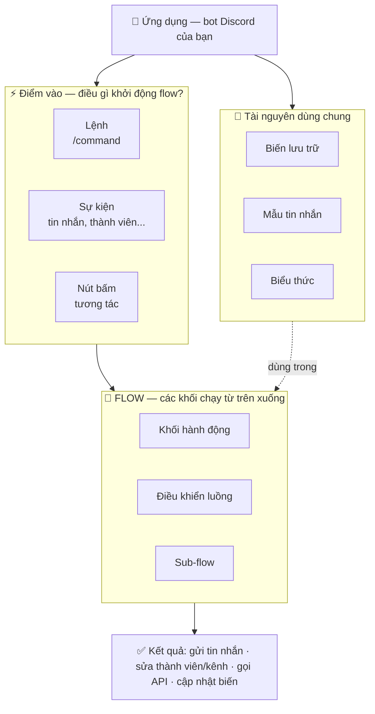

# Chào mừng đến với Vibe Bot! 🪁

Vibe Bot là nền tảng **mã nguồn mở giúp bạn xây dựng bot Discord mà không cần viết một dòng code nào**. Bạn kéo–thả các khối thành một *flow*, và bot sẽ chạy đúng theo flow đó.

Tài liệu này được sắp xếp như một **lược đồ hướng dẫn sử dụng**: bắt đầu từ bức tranh tổng thể, rồi đi dần vào chi tiết từng khối. Nếu mới bắt đầu, hãy đọc theo đúng thứ tự ở mục [Đọc theo thứ tự này](#đọc-theo-thứ-tự-này) bên dưới.

:::tip Vibe Bot đang phát triển
Một số tính năng có thể chưa hoàn thiện hoặc chưa được tài liệu hóa đầy đủ. Theo dõi tiến độ trên [GitHub](https://github.com/sangnekk/Kite) hoặc tham gia [Discord](https://discord.gg/rNd9jWHnXh).
:::

## Vibe Bot hoạt động như thế nào?

Trước khi đi vào chi tiết, hãy nắm mô hình tổng thể. Mọi thứ trong Vibe Bot đều xoay quanh một sơ đồ duy nhất:

Đọc sơ đồ trên theo các bước:

1. **Ứng dụng (App)** — bot Discord bạn tạo trong Vibe Bot. Mỗi app chứa nhiều lệnh, sự kiện và mẫu tin nhắn.
2. **Điểm vào (Trigger)** — thứ khởi động một flow: người dùng gõ một [lệnh](/reference/command), một [sự kiện](/reference/event) xảy ra trong server, hoặc ai đó bấm nút.
3. **Flow** — chuỗi [khối](/reference/blocks/) chạy lần lượt **từ trên xuống dưới**. Đây là phần bạn dựng trong trình soạn thảo no-code.
4. **Tài nguyên dùng chung** — [biến lưu trữ](/reference/variable), [mẫu tin nhắn](/reference/message) và [biểu thức](/reference/expressions) `{{ }}` có thể dùng xuyên suốt mọi flow.
5. **Kết quả** — flow gửi tin nhắn, chỉnh sửa server, gọi API bên ngoài... Mỗi khối chạy tốn một ít [credit](/reference/credit-system).

## Đọc theo thứ tự này

Nếu bạn mới bắt đầu, đây là lộ trình được khuyến nghị:

1. **[Bắt đầu nhanh](/guides/getting-started)** — tạo app Discord đầu tiên và lệnh đầu tiên trong vài phút.
2. **[Lệnh tùy chỉnh](/reference/command)** và **[Sự kiện](/reference/event)** — hai cách chính để khởi động một flow.
3. **[Mẫu tin nhắn](/reference/message)** — thiết kế tin nhắn đẹp để bot gửi đi.
4. **[Biến lưu trữ](/reference/variable)** và **[Biểu thức](/reference/expressions)** — lưu dữ liệu và tính toán động giữa các khối.
5. **[Thư viện khối](/reference/blocks/)** — tra cứu từng khối để dựng flow theo nhu cầu.
6. **[Hệ thống credit](/reference/credit-system)** — hiểu chi phí mỗi hành động để dùng tiết kiệm.

## Tôi muốn làm... → đọc trang nào?

| Bạn muốn... | Đọc trang |
| --- | --- |
| Tạo bot và lệnh đầu tiên | [Bắt đầu nhanh](/guides/getting-started) |
| Cho bot trả lời một slash command | [Lệnh tùy chỉnh](/reference/command) → [Tạo tin nhắn phản hồi](/reference/blocks/actions/action_response_create) |
| Tự động phản hồi khi có thành viên vào/tin nhắn mới | [Sự kiện](/reference/event) |
| Thiết kế tin nhắn có embed, nút bấm | [Mẫu tin nhắn](/reference/message) |
| Lưu điểm, số dư, dữ liệu giữa các lần chạy | [Biến lưu trữ](/reference/variable) · [Khối kinh tế](/reference/blocks/#khối-kinh-tế) |
| Tính toán, lấy đối số, ghép chuỗi động | [Biểu thức](/reference/expressions) |
| Rẽ nhánh theo điều kiện, lặp lại hành động | [Khối điều khiển luồng](/reference/blocks/#khối-điều-khiển-luồng) |
| Gọi API bên ngoài / dùng AI | [Gửi yêu cầu API](/reference/blocks/actions/action_http_request) · [Hỏi AI](/reference/blocks/actions/action_ai_chat_completion) |
| Cho bot dùng được ở mọi server | [Ứng dụng cài cho người dùng](/guides/user-installable-apps) |
| Hiểu vì sao bot hết lượt chạy | [Hệ thống credit](/reference/credit-system) |

---

Sẵn sàng chưa? Bắt đầu [tại đây](/guides/getting-started)! 🚀
