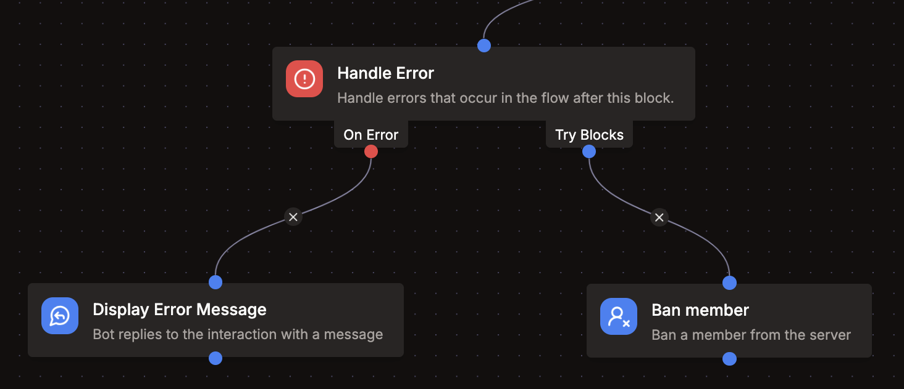

import EmbedFlowNode from "../../../../src/components/EmbedFlowNode";

# Xử lý lỗi

<EmbedFlowNode type="control_error_handler" />

Khối `Handle Errors` cho phép bạn chạy logic tùy chỉnh khi có lỗi xảy ra trong các khối con của nó.

Thông báo lỗi có sẵn dưới dạng kết quả của khối này. Bạn có thể dùng nó để hiển thị tin nhắn cho người dùng hoặc xử lý lỗi theo cách khác.

Điều này hữu ích nếu bạn không muốn dùng cơ chế xử lý lỗi mặc định. Nếu vẫn muốn ghi log lỗi, bạn có thể dùng khối `Log Message`.

