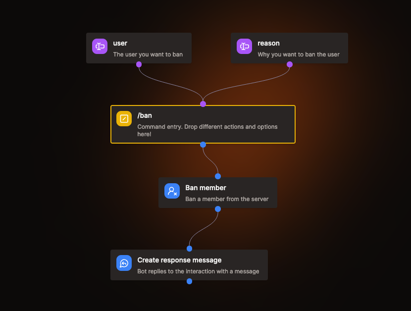

# Lệnh tùy chỉnh

Lệnh tùy chỉnh là cách chính để người dùng tương tác với bot của bạn. Sau khi tạo lệnh đầu tiên, người dùng có thể sử dụng bằng cách gõ `/` trong khung chat Discord.

## Lệnh con

Thêm khoảng trắng (` `) vào tên lệnh để tạo lệnh con. Cách này giúp nhóm các lệnh liên quan một cách logic và dễ hiểu hơn cho người dùng.

## Triển khai lệnh

Bất cứ khi nào bạn tạo lệnh mới hoặc cập nhật lệnh hiện có, Vibe Bot sẽ tự động triển khai thay đổi lên Discord trong vòng 60 giây.
Đôi lúc bạn cần khởi động lại hoặc tải lại (ctrl+r) ứng dụng Discord để thấy thay đổi.

Hãy kiểm tra nhật ký ứng dụng ở trang tổng quan để xem có lỗi nào không.

