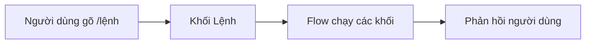
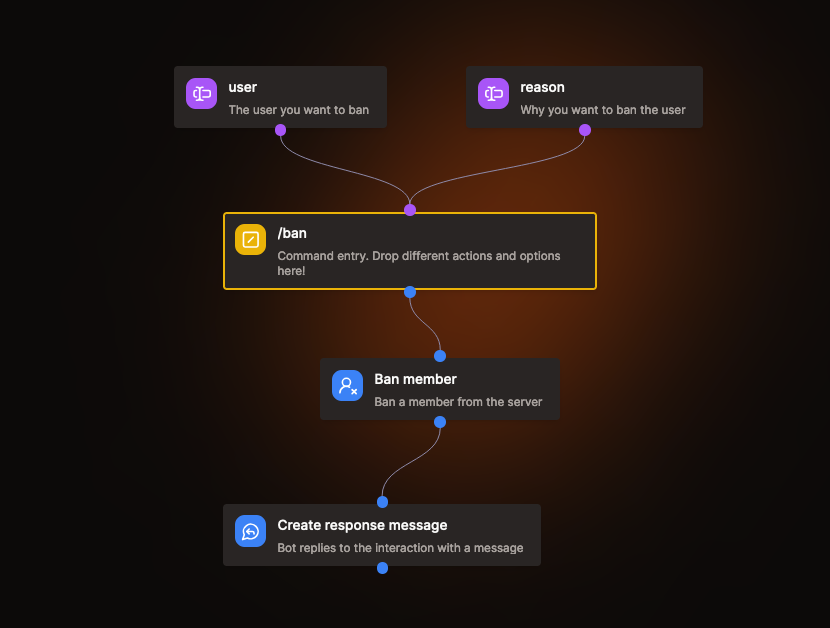

# Lệnh tùy chỉnh

Lệnh tùy chỉnh là cách chính để người dùng tương tác với bot của bạn. Sau khi tạo lệnh đầu tiên, người dùng có thể sử dụng bằng cách gõ `/` trong khung chat Discord.

Lệnh là một trong ba **điểm vào** khởi động một flow — cùng với [sự kiện](/reference/event) và nút bấm (xem [lược đồ tổng thể](/)). Khi người dùng gọi lệnh, flow gắn với lệnh sẽ chạy lần lượt từ trên xuống:

```mermaid
flowchart LR
    U["Người dùng gõ /lệnh"] --> Cmd["Khối Lệnh"]
    Cmd --> Flow["Flow chạy các khối"]
    Flow --> Resp["Phản hồi người dùng"]
```

## Lệnh con

Thêm khoảng trắng (` `) vào tên lệnh để tạo lệnh con. Cách này giúp nhóm các lệnh liên quan một cách logic và dễ hiểu hơn cho người dùng.

## Triển khai lệnh

Bất cứ khi nào bạn tạo lệnh mới hoặc cập nhật lệnh hiện có, Vibe Bot sẽ tự động triển khai thay đổi lên Discord trong vòng 60 giây.
Đôi lúc bạn cần khởi động lại hoặc tải lại (ctrl+r) ứng dụng Discord để thấy thay đổi.

Hãy kiểm tra nhật ký ứng dụng ở trang tổng quan để xem có lỗi nào không.

## Liên quan

- [Khối Lệnh](/reference/blocks/entries/entry_command) — điểm bắt đầu của flow lệnh
- [Tạo tin nhắn phản hồi](/reference/blocks/actions/action_response_create) — trả lời người dùng
- [Đối số lệnh](/reference/blocks/options/option_command_argument), [Quyền lệnh](/reference/blocks/options/option_command_permissions), [Quyền lệnh (Bot)](/reference/blocks/options/option_command_bot_permissions), [Bối cảnh lệnh](/reference/blocks/options/option_command_contexts) — tinh chỉnh lệnh
- [Biểu thức](/reference/expressions) — lấy giá trị đối số bằng `arg('tên')`
- [Sự kiện](/reference/event) — điểm vào còn lại để tự động hóa
