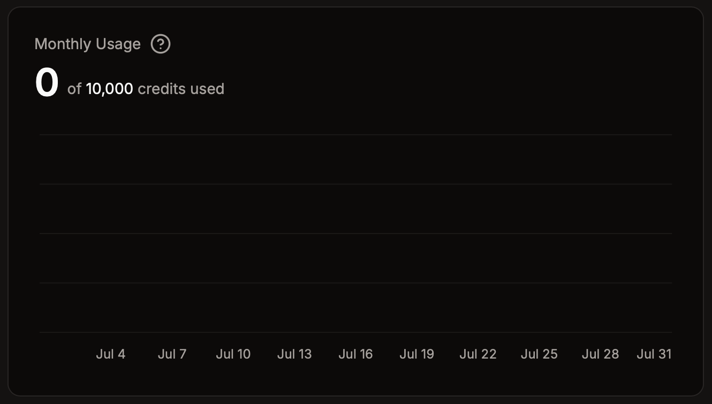

# Hệ thống credit

Vibe Bot miễn phí để sử dụng, nhưng có hệ thống credit để ngăn chặn lạm dụng. Hầu hết hành động trong flow của ứng dụng đều tiêu tốn credit.

Mặc định, ứng dụng của bạn có **10.000 credit mỗi tháng**. Mức này thường đủ cho phần lớn ứng dụng. Bạn có thể đăng ký gói **Premium** để nhận thêm credit.

## Chi phí theo từng khối

Phần lớn hành động trong flow tiêu tốn **1 credit cho mỗi lần chạy**, ngoại trừ một số khối sau:

- **Khối `Ask AI`**:
  - `gpt-4.1`: 100 credits per execution
  - `gpt-4.1-mini`: 20 credits per execution
  - `gpt-4.1-nano`: 5 credits per execution
  - `gpt-4o-mini` (default): 5 credits per execution
- **Khối `Search The Web`**:
  - `gpt-4.1`: 500 credits per execution
  - `gpt-4.1-mini`: 100 credits per execution
  - `gpt-4.1-nano`: 25 credits per execution
  - `gpt-4o-mini` (default): 25 credits per execution
- **Khối `Send API request`**: 3 credits per execution

Các khối điều kiện, vòng lặp và khối điều khiển luồng khác sẽ không tiêu tốn credit.

## Mẹo sử dụng

Vì mỗi hành động trong flow đều tiêu tốn credit, bạn nên chỉ chạy hành động khi cần thiết. Ví dụ, thường không nên chạy hành động với mọi tin nhắn. Thay vào đó, hãy dùng điều kiện để chỉ chạy khi đáp ứng tiêu chí cụ thể.
