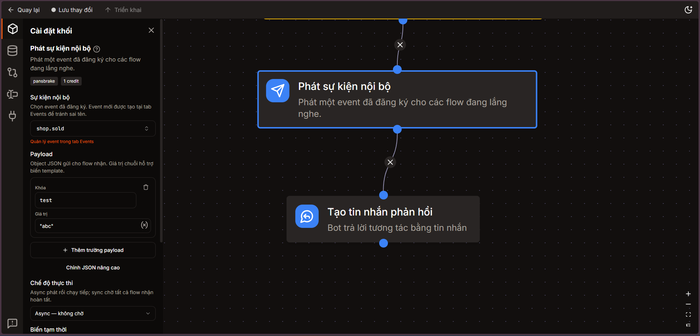
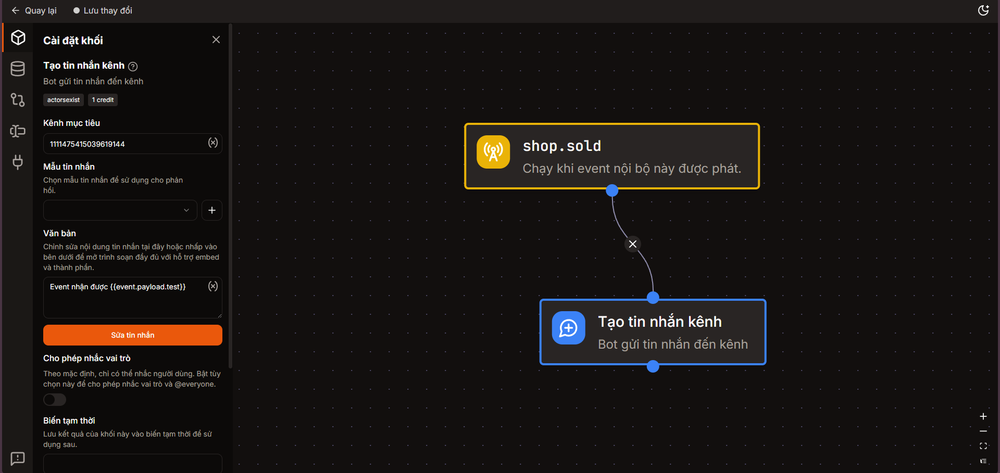
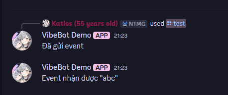
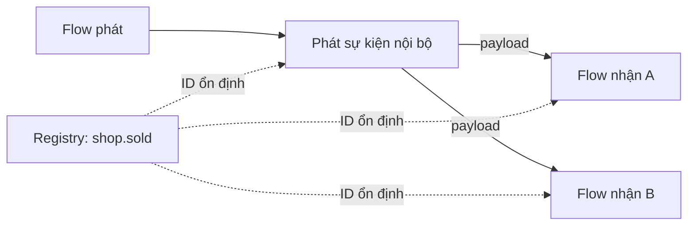

# Sự kiện nội bộ tùy chỉnh

Sự kiện nội bộ cho phép một flow phát tín hiệu để một hoặc nhiều flow khác trong cùng ứng dụng tự động chạy.

:::warning Truy cập payload ở flow nhận

Payload của sự kiện nhận nằm trong `event.payload`, **không** nằm trong `result()`.

Ví dụ, với payload `{ "test": "abc" }`, dùng `{{ event.payload.test }}` để nhận giá trị `abc`.

:::

## Bắt đầu nhanh

Ví dụ sau phát sự kiện `shop.sold` với payload `{ "test": "abc" }` rồi đọc payload trong flow nhận.

1. Mở trang **Sự kiện** của ứng dụng.
2. Trong mục **Sự kiện nội bộ**, bấm **Đăng ký event**.
3. Đặt event key là `shop.sold` rồi lưu lại.
4. Trong flow phát, thêm khối **Phát sự kiện nội bộ** và chọn `shop.sold`.
5. Thêm trường payload:

```json
{
  "test": "abc"
}
```



*Flow phát chọn event `shop.sold`, gửi trường `test` có giá trị `abc` và chạy ở chế độ async.*

6. Quay lại trang **Sự kiện**, tạo một bộ lắng nghe có nguồn **Sự kiện nội bộ** và chọn cùng event key.
7. Trong flow nhận, dùng placeholder sau ở nội dung tin nhắn hoặc trường có hỗ trợ biểu thức:

```text
{{ event.payload.test }}
```



*Flow nhận đọc trường payload bằng `{{ event.payload.test }}` và đưa giá trị vào tin nhắn.*

Khi flow phát chạy, flow nhận lấy được giá trị `abc`:



Dấu ngoặc kép trong tin nhắn kết quả đến từ mẫu nội dung `Event nhận được "{{ event.payload.test }}"`; giá trị payload thực tế vẫn là chuỗi `abc`.



## Đăng ký event key

Event key phải được tạo trước trong mục **Sự kiện nội bộ** ở trang **Sự kiện**. Khối phát và bộ lắng nghe chỉ cho chọn từ registry này, không cho nhập tên tự do.

Tên event:

- Chỉ dùng chữ thường, chữ số và dấu gạch dưới.
- Có thể chia namespace bằng dấu chấm, ví dụ `shop.item_purchased`.
- Phải bắt đầu bằng một chữ cái.
- Có thể dài tối đa 128 ký tự.

Mỗi event có một ID ổn định. Vì flow lưu ID thay vì lưu tên, bạn có thể sửa lỗi chính tả trong tên event mà không phải nối lại các flow đang dùng event đó.

## Phát payload

Trong khối [Phát sự kiện nội bộ](/reference/blocks/actions/action_event_emit), payload là một object gồm các cặp key/value. Giá trị chuỗi hỗ trợ placeholder giống các trường khác trong flow.

Ví dụ gửi thông tin giao dịch:

```json
{
  "user_id": "{{ user.id }}",
  "item_id": "sword_01",
  "price": 500,
  "premium": true
}
```

Kite giữ nguyên kiểu dữ liệu của payload. Trong ví dụ trên, `price` là số và `premium` là boolean, không phải chuỗi.

Trình soạn thảo mặc định hiển thị payload dưới dạng các hàng key/value. Dùng **Chỉnh JSON nâng cao** khi cần object hoặc mảng lồng nhau.

## Đọc payload ở flow nhận

Flow bắt đầu bằng khối [Khi có sự kiện nội bộ](/reference/blocks/entries/entry_custom_event) nhận các biến sau:

| Biến | Kiểu | Mô tả |
| --- | --- | --- |
| `event.name` | string | Tên hiện tại của event, ví dụ `shop.item_purchased` |
| `event.payload` | object | Toàn bộ payload do flow phát gửi sang |
| `event.payload.{key}` | any | Một trường cụ thể trong payload |
| `event.timestamp` | string | Thời điểm event được phát theo định dạng RFC 3339 |
| `app` | object | Bot của ứng dụng, nếu ứng dụng đang có phiên hoạt động |

Trong trường có hỗ trợ placeholder, bao biểu thức bằng `{{ }}`:

```text
Người dùng {{ event.payload.user_id }} đã mua {{ event.payload.item_id }}.
```

Trong **Điều kiện lọc** hoặc khối **Tính biểu thức**, viết biểu thức trực tiếp, không thêm `{{ }}`:

```text
event.payload.price >= 1000
```

Custom event không tự cung cấp `user`, `member`, `message`, `channel` hoặc `guild`. Nếu flow nhận cần các giá trị này, hãy gửi ID hoặc dữ liệu cần thiết trong payload.

## Phân biệt `event.payload` và `result()`

Hai cú pháp này phục vụ hai phạm vi khác nhau:

| Cú pháp | Dùng ở đâu | Dữ liệu trả về |
| --- | --- | --- |
| `event.payload.test` | Flow nhận | Trường `test` do flow phát gửi sang |
| `result('emit_node')` | Flow phát, sau khối emit | Metadata của lần phát event |
| `result('other_node')` | Cùng flow, sau một khối khác | Kết quả của khối đó |

Khối emit trả về metadata sau:

```yaml
event_id: string
event_name: string
subscriber_count: number
mode: async | sync
```

Ví dụ lấy số flow đã nhận sự kiện từ khối có ID `emit_purchase`:

```text
{{ result('emit_purchase').subscriber_count }}
```

`result('emit_purchase').test` không tồn tại vì payload không phải là kết quả của khối emit.

## Chọn chế độ thực thi

| Chế độ | Hành vi | Khi nên dùng |
| --- | --- | --- |
| `async` | Phát event rồi tiếp tục flow hiện tại ngay, không chờ flow nhận | Ghi log, cập nhật nhiệm vụ, thông báo nền |
| `sync` | Chờ tất cả flow nhận chạy xong rồi mới tiếp tục | Flow phát phụ thuộc vào việc xử lý hoàn tất hoặc cần nhận lỗi |

Với `sync`, tất cả subscriber đều được chạy. Nếu một subscriber lỗi, khối emit trả lỗi sau khi quá trình dispatch hoàn tất. Với `async`, lỗi của subscriber được ghi vào nhật ký của bộ lắng nghe và không làm dừng flow phát.

## Lọc sự kiện nhận

Điền **Điều kiện lọc** ở khối entry để chỉ chạy flow với payload phù hợp. Biểu thức phải trả về boolean.

Ví dụ chỉ nhận giao dịch từ 1.000 trở lên:

```text
event.payload.price >= 1000
```

Ví dụ chỉ nhận một loại hành động:

```text
event.payload.action == "daily"
```

Để trống điều kiện nếu flow cần nhận mọi lần phát của event.

## Nhiều flow cùng nhận một event

Bạn có thể tạo nhiều bộ lắng nghe cùng chọn một event key. Mỗi lần emit, Kite tạo một lần chạy riêng cho từng bộ lắng nghe đang bật.

Ví dụ `shop.item_purchased` có thể đồng thời kích hoạt:

- Flow cập nhật nhiệm vụ.
- Flow kiểm tra thành tựu.
- Flow ghi audit log.
- Flow gửi thông báo mua hàng.

## Giới hạn và lỗi thường gặp

- Payload sau khi xử lý placeholder không được vượt quá **64 KiB**.
- Chuỗi event lồng nhau có độ sâu tối đa **8** để ngăn vòng lặp vô hạn.
- Emitter và listener phải thuộc cùng một ứng dụng.
- Bộ lắng nghe đang tắt không được tính là subscriber và không chạy.
- Event key phải tồn tại trong registry trước khi cấu hình emitter hoặc listener.
- Điều kiện lọc phải trả về `true` hoặc `false`; trả về chuỗi hoặc số sẽ làm lần chạy thất bại.

## Liên quan

- [Phát sự kiện nội bộ](/reference/blocks/actions/action_event_emit)
- [Khi có sự kiện nội bộ](/reference/blocks/entries/entry_custom_event)
- [Bộ lắng nghe sự kiện](/reference/event)
- [Biểu thức](/reference/expressions)
