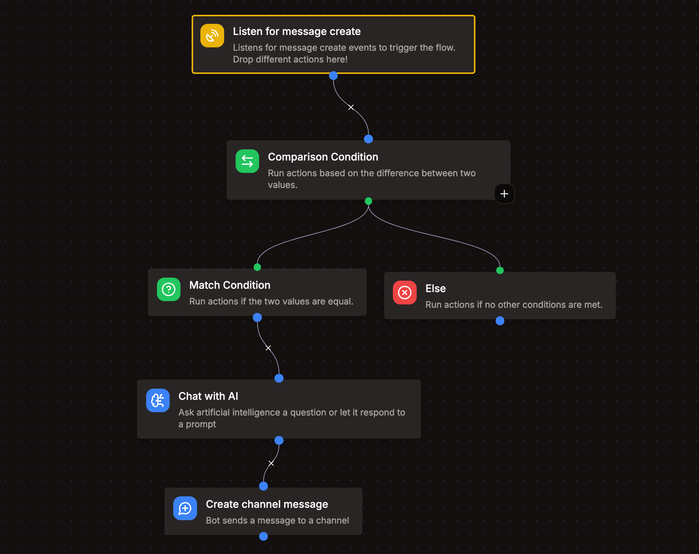

# Bộ lắng nghe sự kiện

Với bộ lắng nghe sự kiện, bạn có thể theo dõi các sự kiện diễn ra trong server Discord mà bot của bạn tham gia. Hiện tại Vibe Bot hỗ trợ các sự kiện sau:

- Message Create
- Message Update
- Message Delete
- Member Join
- Member Leave

## Giới hạn

- Bạn chỉ có thể tạo tối đa 5 bộ lắng nghe sự kiện cho mỗi ứng dụng.
- Vibe Bot sẽ bỏ qua các tin nhắn được gửi bởi bot.
- Sự kiện thành viên chỉ khả dụng khi bạn bật "Server Members Intent" trong [Discord Developer Portal](https://discord.dev).

