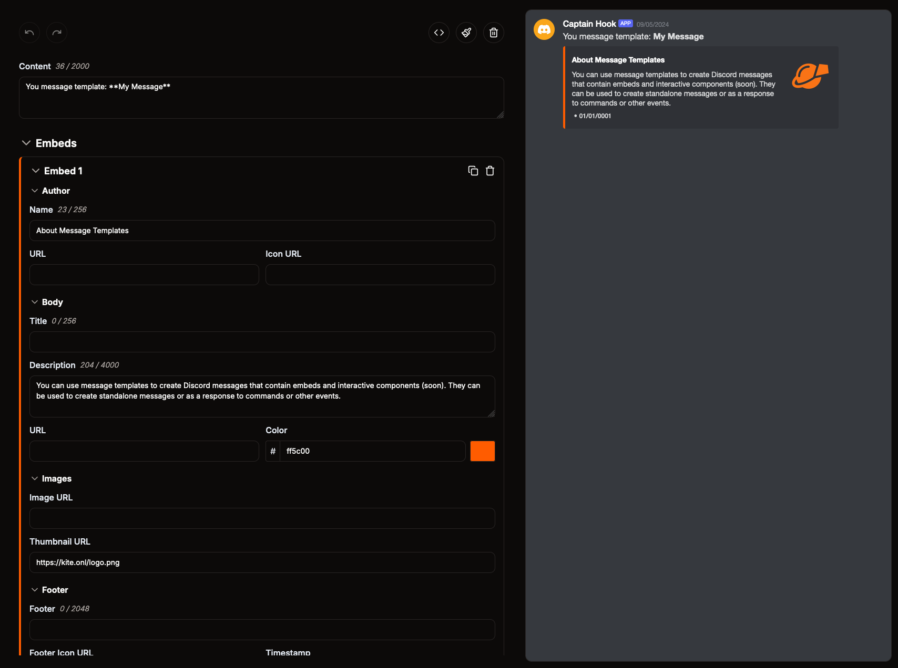
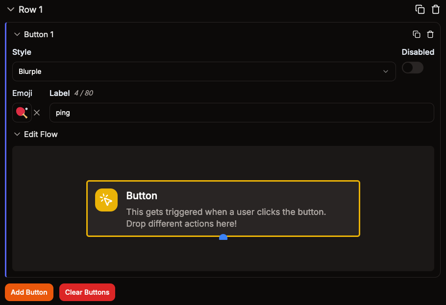

# Mẫu tin nhắn

Mẫu tin nhắn là cách tốt nhất để tạo ra các tin nhắn Discord được tùy chỉnh hoàn toàn theo ý muốn. Sau khi tạo, bạn có thể gửi mẫu tin nhắn trực tiếp vào kênh Discord hoặc dùng làm phản hồi cho lệnh và sự kiện.

Mẫu tin nhắn hỗ trợ đầy đủ tính năng embed của Discord, đính kèm tệp, và các thành phần tương tác.

## Thành phần tương tác

Bạn có thể thêm các thành phần tương tác như nút bấm vào tin nhắn để người dùng tương tác.

