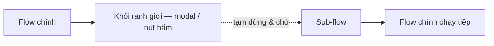
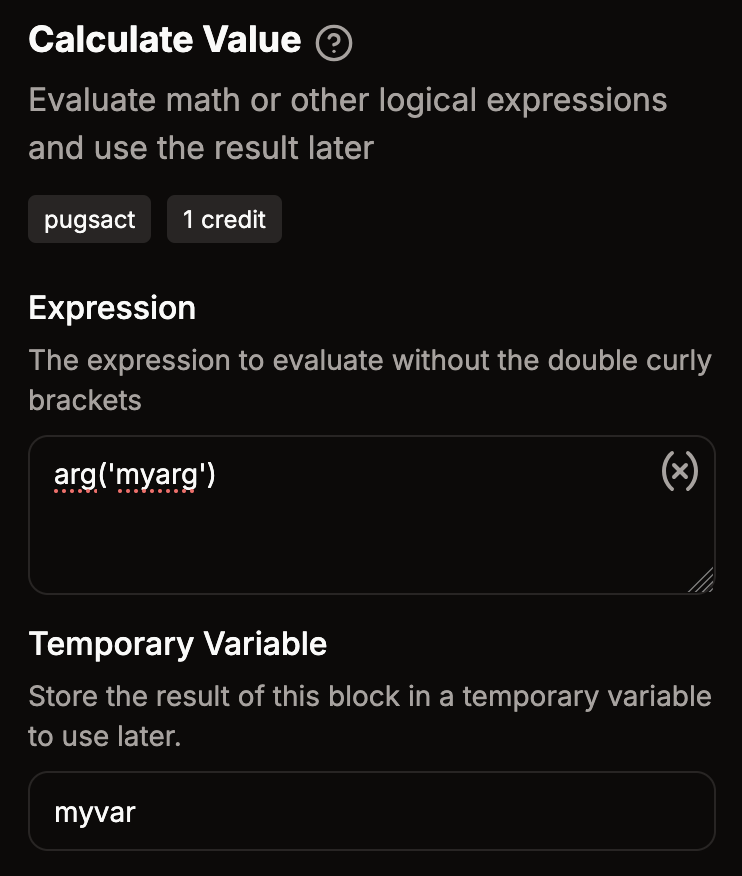
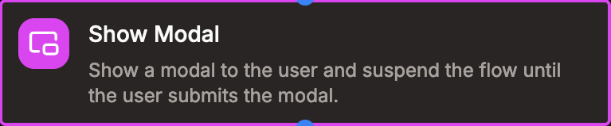
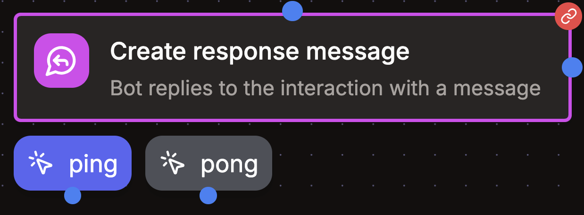

# Sub-flow

Một số khối trong flow có thể tạo ra sub-flow. Các khối này đóng vai trò ranh giới giữa flow chính và sub-flow, và được hiển thị màu hồng trong trình soạn thảo.

:::warning
Các placeholder ngữ cảnh như placeholder `interaction` của flow chính không khả dụng bên trong sub-flow — chúng được thay thế bởi placeholder `interaction` của chính sub-flow đó. Ngược lại, kết quả của các khối và biến tạm thời vẫn có thể truy cập bình thường.

Để giải quyết vấn đề này, hãy dùng khối `Tính toán giá trị` để lưu giá trị của placeholder ngữ cảnh vào một biến tạm thời trước khi vào sub-flow. Nhờ vậy bạn vẫn có thể dùng giá trị đó bên trong sub-flow.

Xem ví dụ

:::

## Modal

Modal là một loại sub-flow đặc biệt dùng để tạo trải nghiệm tương tác với người dùng. Khi modal được mở, flow tạm dừng và hiển thị form cho người dùng điền. Sau khi người dùng gửi form, flow tiếp tục thực thi. Bạn có thể truy cập nội dung người dùng đã nhập thông qua placeholder `interaction.components`.

Modal thường được dùng để tạo form nhập liệu, khảo sát, hoặc các trải nghiệm tương tác khác.

## Tin nhắn có nút bấm

Khi bạn thêm nút bấm vào tin nhắn, tin nhắn đó trở nên tương tác. Sau khi tin nhắn được gửi và người dùng bấm vào một nút, flow tiếp tục thực thi từ nhánh tương ứng với nút đó. Bạn chỉ cần kéo các khối hành động và nối vào từng nút.

## Liên quan

- [Hiển thị modal](/reference/blocks/actions/suspend_response_modal) — mở form nhập liệu (một loại sub-flow)
- [Tạo tin nhắn kênh](/reference/blocks/actions/action_message_create) — thêm nút bấm để tạo nhánh tương tác
- [Nút bấm](/reference/blocks/entries/entry_component_button) — điểm vào cho tương tác nút bấm
- [Biểu thức](/reference/expressions) — đọc nội dung người dùng nhập bằng `input('id')`
