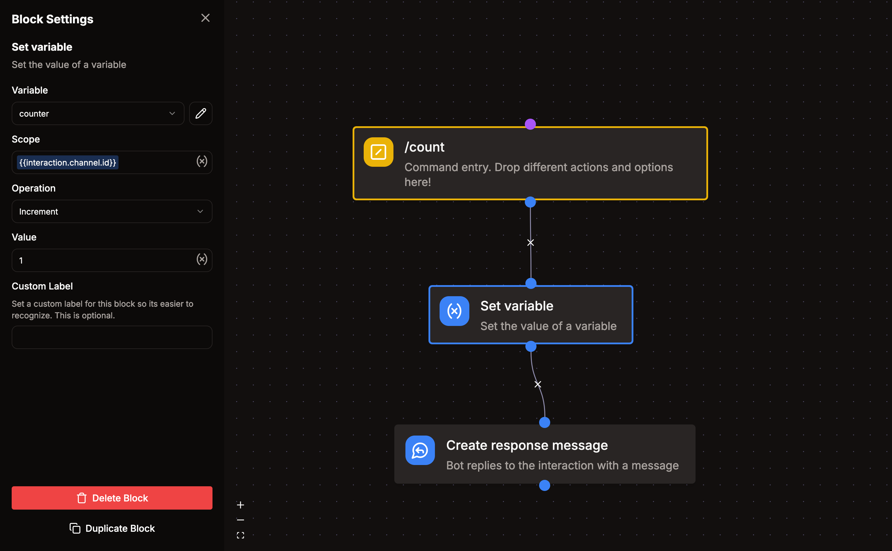

# Biến lưu trữ

Với biến lưu trữ, bạn có thể lưu dữ liệu dùng chung giữa lệnh, sự kiện và mẫu tin nhắn.

Bạn có thể truy cập chúng trong lệnh hoặc bộ lắng nghe sự kiện bằng các khối "Set variable" hoặc "Get variable".

Biến có thể được phân phạm vi theo một khóa bất kỳ. Ví dụ phổ biến là ID người dùng, ID kênh hoặc ID server. Cách này cho phép bạn lưu nhiều giá trị trong cùng một biến và truy cập lại sau đó.

