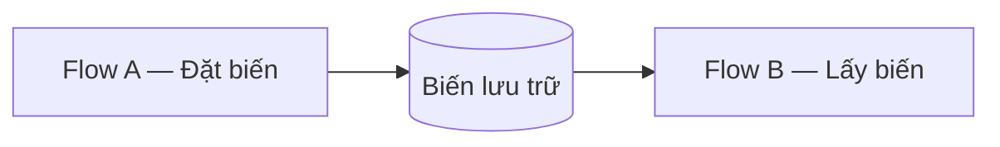
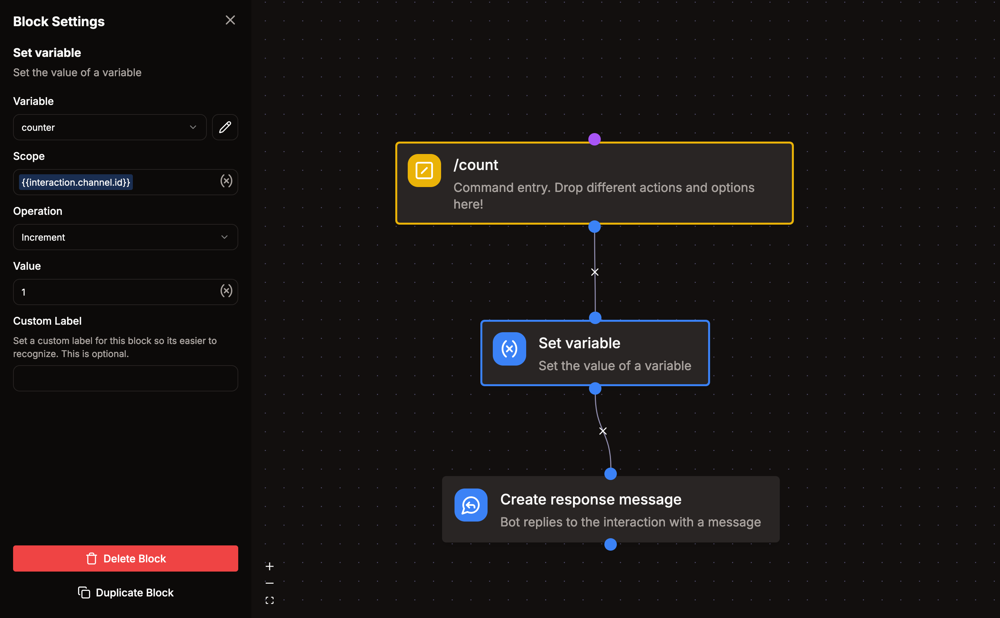

# Biến lưu trữ

Với biến lưu trữ, bạn có thể lưu dữ liệu dùng chung giữa lệnh, sự kiện và mẫu tin nhắn. Đây là **tài nguyên dùng chung** trong [lược đồ tổng thể](/): dữ liệu tồn tại ngay cả sau khi flow chạy xong, nên flow chạy sau vẫn đọc lại được giá trị mà flow trước đã ghi.

Bạn có thể truy cập chúng trong lệnh hoặc bộ lắng nghe sự kiện bằng các khối "Set variable" hoặc "Get variable".

```mermaid
flowchart LR
    A["Flow A — Đặt biến"] --> DB[("Biến lưu trữ")]
    DB --> B["Flow B — Lấy biến"]
```

Biến có thể được phân phạm vi theo một khóa bất kỳ. Ví dụ phổ biến là ID người dùng, ID kênh hoặc ID server. Cách này cho phép bạn lưu nhiều giá trị trong cùng một biến và truy cập lại sau đó.

## Liên quan

- [Đặt biến lưu trữ](/reference/blocks/actions/action_variable_set), [Lấy biến lưu trữ](/reference/blocks/actions/action_variable_get), [Xóa biến lưu trữ](/reference/blocks/actions/action_variable_delete)
- [Khối kinh tế](/reference/blocks/#khối-kinh-tế) — mỗi loại tiền tệ là một biến có bật phạm vi (scoped)
- [Biểu thức](/reference/expressions) — dùng giá trị biến trong tính toán và placeholder
